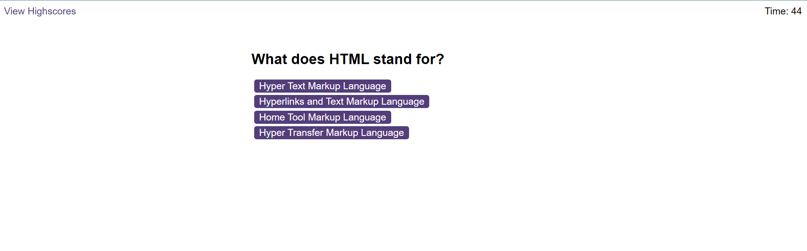
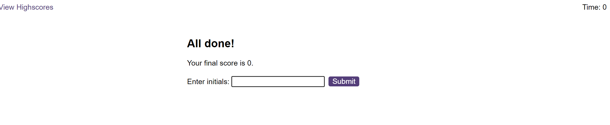

# A timed-coding-quiz
In this repository, I showcase a timed coding quiz that I designed using HTML, CSS and JavaScript.
If a participant takes the code quiz and click the start button, the timer will start immediately. 

Once the time starts, the participant is presented with a question and once a question is answered, another questions comes up on the screen!
When an answer is incorrect, the time is subtracted from the clock.

The interesting thing is that once when all questions are answered or the timer reaches 0, the game is over!

Also, when the game is over, the web application will save the participant's initials and the score. 

The project is located at the following link:
https://mikemupararano.github.io/timed-coding-quiz/
https://github.com/Mikemupararano/timed-coding-quiz

## Table of Contents (Optional)
N/A

## Installation

No installation is required.

## Usage 
A screenshot of the work, is shown here:

## Credits

To complete this task, I have used for example the following:
https://simplestepscode.com/javascript-quiz-tutorial/
https://www.geeksforgeeks.org/how-to-create-a-simple-javascript-quiz/
https://www.youtube.com/watch?v=MgeQa7qXIwI
https://www.codingninjas.com/studio/library/how-to-create-a-javascript-quiz-code
## License
Readers should refer to the MIT License in the repository.

## Badges

N/A

## Features

N/A

## Contributing

Collaborations are welcome here:
https://github.com/Mikemupararano/timed-coding-quiz
https://mikemupararano.github.io/timed-coding-quiz/
## Tests

N/A
---

© 2023 edX Boot Camps LLC. Confidential and Proprietary. All Rights Reserved.

